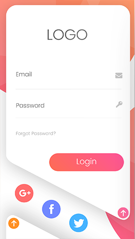
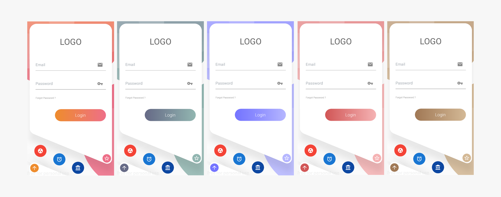

# LoginUI

LoginUI is an Interface design implementation in Flutter

Original design from
[here](https://dribbble.com/shots/4136007-UI-App-Design-Login-Signup)
:
<div style="text-align:center">

</div>


The final result (Without animation) :


<div style="text-align:center">

</div>

The final result (With animation) :


<div style="text-align:center">

</div>

This work is a part of Flutter UI Challenge.
## Getting Started

To use this code copy "LoginUI.dart" to your project folder and add this line to your code.

```Dart
LoginUI(startColor: Color.fromRGBO(238, 140, 45, 1), endColor:Color.fromRGBO(238, 111, 136, 1))
```

For help getting started with Flutter, view the online
[documentation](https://flutter.io/).
