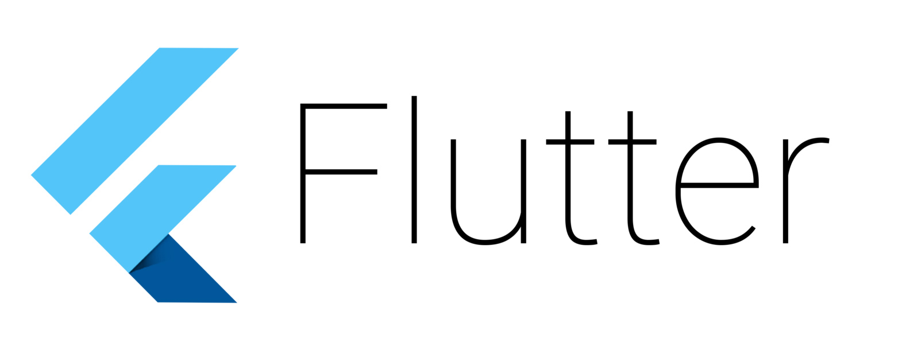

# Flutter UI Challenges

Flutter UI design implementation repository for interesting UI Designs that
are available in websites like <a href="https://dribbble.com" target="_blank">Dribbble</a>
.

The challenge is to see if we can re create any design out there
(including animations etc) using just Flutter. 

| Name          | Link          | Original Design  |
|:-------------|:-------------:|:----------------:|
| Dribbble SIgn In | [Link](https://github.com/Timodz/Flutter-Ui-Challenges/tree/master/dribbble_signin) | [Dribbble](https://dribbble.com/shots/5303322-Dribbble-login-screen-redesign)            |
| Simple Login | [Link](https://github.com/Timodz/Flutter-Ui-Challenges/tree/master/Simple_Login) | [Dribbble](https://dribbble.com/shots/5086335-Login-Page)            |
| LoginUI | [Link](https://github.com/Timodz/Flutter-Ui-Challenges/tree/master/LoginUI) | [Dribbble](https://dribbble.com/shots/4136007-UI-App-Design-Login-Signup)            |
| Custom Menu | [Link](https://github.com/Timodz/Flutter-Ui-Challenges/tree/master/Custom%20Menu) |          |

If you have any interfaces to add, feel free to fire a pull request or contact me at : `elbez.hammouda@gmail.com`

# License
This repository is licensed under the [
GNU GPL v3.0](LICENSE)
