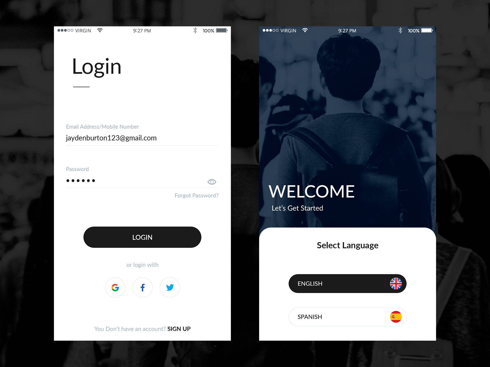
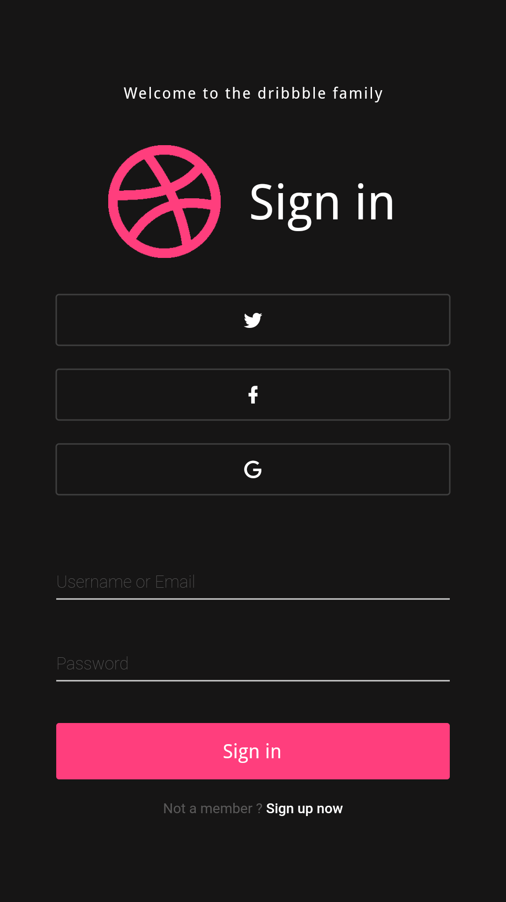

# Simple_Login

Simple_Login is an Interface design implementation in Flutter

Original design from
[here](https://dribbble.com/shots/5086335-Login-Page)
:

The final result (Without animation) :

The final result (With animation) :

This work is a part of Flutter UI Challenge.
## Getting Started

For help getting started with Flutter, view the online
[documentation](https://flutter.io/).
