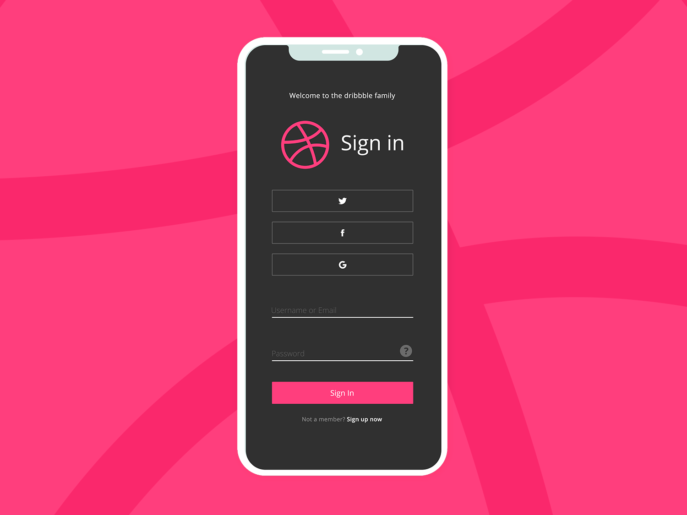
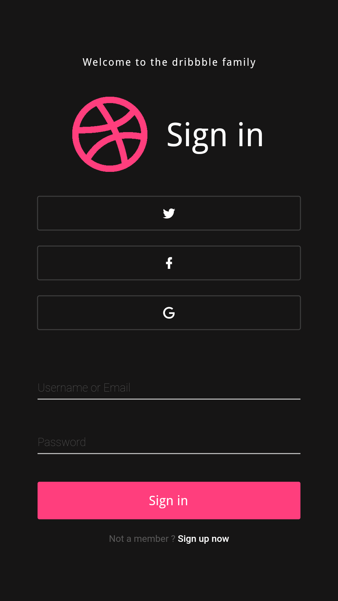

# Dribbble_SignIn

Dribbble Sign In Interface design implementation in Flutter

Original design from
[here](https://dribbble.com/shots/5303322-Dribbble-login-screen-redesign)
:

The final result :

This work is a part of Flutter UI Challenge.
## Getting Started

For help getting started with Flutter, view the online
[documentation](https://flutter.io/).
